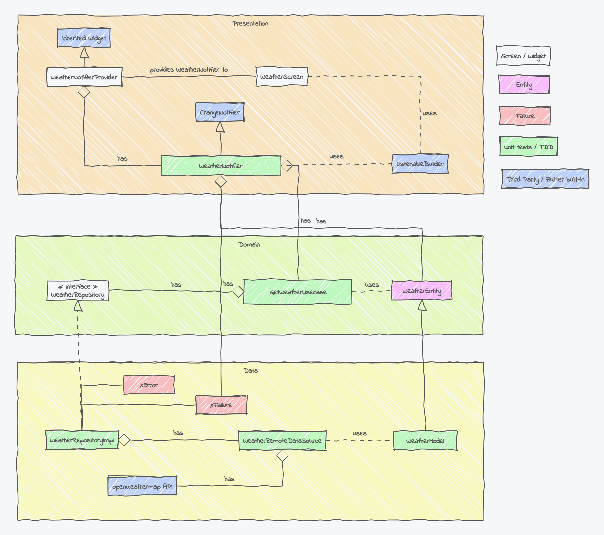

# Flutter Lightweight Clean Architecture Example

This is a lightweight example (with a lot of documentation) for a clean architecture and test-driven app in Flutter. It fetches weather data from [OpenWeatherMap](https://openweathermap.org) and displays it. This example is adapted from [this tutorial](https://www.youtube.com/watch?v=g2Mup12MccU) - see other sources and inspirations below. Since November 2024 the official Flutter documentation now contains an [approach](https://docs.flutter.dev/app-architecture) that is roughly similar but not identical to the one described here.  

## Architecture overview 



The application has three layers: Presentation, Domain and Data. 

### Presentation layer

The user interface consists of one `WeatherScreen`. The `WeatherNotifier` is a ChangeNotifier. It has a `WeatherEntity` and gets a `GetWeatherUsecase` via the constructor. It calls the use case with the name of the city, sets the entity and notifies the `ListenableBuilder` widget in the `WeatherScreen` which will the rebuild. When the `TextField` changes, `WeatherNotifierProvider` provides the `WeatherNotifier`'s `getCurrentWeather()` method. A debounce mechanism limits the number of calls.

The `WeatherNotifierProvider`, an Inherited Widget, provides the `WeatherNotifier`. This is set up in `main.dart`.

### Domain layer

Clean architecture dictates that this central layer does not depend either on the user interface (ui layer) or on the remote API (data layer). 

A use case represents a user action. The `GetWeatherUsecase` receives (the abstract) `WeatherRepository` passed in via the constructor and calls its method. The repository in turn either returns a `Failure` object or a `WeatherEntity`. It is separated into an abstract class inside the Domain layer that defines the contract (interface) and a concrete class in the Data layer that implements it. This technique implements the Dependeny Inversion Principle and embodies the Dependency Rule: dependencies point "inwards" toward higher level policies, the Domain layer in this architecture.

`WeatherEntity` is an immutable pure data class that contains the fields we are interested in. Although we don't test it directly it uses the equatable package so that instances of `WeatherModel` can be compared in tests. 

Use cases are implemented as callable classes (with a call method) and common interface. This could be implemented with an abstract superclass and additional work on the parameters going into the call method, which I didn't do for brevity here.

### Data layer

The data layer is responsible for wrapping data sources, here the [OpenWeatherMap API](https://openweathermap.org/current). 

The `WeatherModel` class extends `WeatherEntity`. It adds a constructor to create an instance from a subset of the JSON format that is coming from the `DataSource`. It also has a method to transform itself into a `WeatherEntity`. 

The `WeatherRemoteDataSource` takes an http client passed in its constructor and its method retuns a Future of a `WeatherModel` converted from JSON. To do this, it talks to the remote OpenWeatherMap API, for which you need to sign up for a free API key. I keep all the information necessary inside the `WeatherRemoteDataSource` class. As with `GetWeatherUsecase` above, I do not add another layer of abstraction by separating it into an abstract superclass and concrete subclass as suggested by some other tutorials. 

The `WeatherRepositorImpl` class implements the contract of the `WeatherRepository`. It has a `WeatherRemoteDataSource` passed into the constructor and calls its method. It then uses try/catch to either 
* transform the `WeatherModel` returned from sucessful API calls into a `WeatherEntity` (Right side of `Either`) or 
* transform exceptions into `Failure` objects (Left side of `Either`). 

### Common objects and functions

The API call to retrieve the current weather for a city is returned in `urls.dart`: `https://api.openweathermap.org/data/2.5/weather?q=<CITY NAME>&units=metric&appid=<API KEY>`. I am adding the `units=metric` parameter retrieve the temperature in degree Celsius. Because the API key should not be stored in a code repository, it is injected from the environment. Therefore the app must be called like this:
`flutter run --dart-define OWM_API_KEY=<API KEY> --hot`. In production, the key would be provided by the user at the start of the app / from a settings screen.

There are various topics around handling API keys in Flutter, see: https://codewithandrea.com/articles/flutter-api-keys-dart-define-env-files/.

`Failure` is an abstract class, extended by concrete Failures, e.g. `ServerFailure`. Each `Failure` subclass is mirrored by a corresponding `Exception`. 

### main.dart

In `main.dart`, the `WeatherNotifierProvider` is inserted into the Widget Tree. Here the classes down the dependeny chain are explicitely instatiated: `WeatherNotifier`, `GetWeatherUsecase` and `WeatherRepositoryImpl`.

## Order of implementation: Domain -> Data -> Presentation 

It is a good idea to start with the Domain layer because the other layers depend on it. Then we implement the Data layer, which has most of the implementation and requires more work handling API responses, writing tests and dealing with errors. The Presenttion layer with the user interface and Flutter state management comes last (or can be designed in parallel).   

Implement the Domain Layer

1. WeatherEntity
2. WeatherRepository
3. Failure
4. GetWeatherUsecase (TDD) (alternatively start from here)

Implement the Data Layer

5. WeatherModel (TDD)
6. WeatherRemoteDataSource (TDD)
7. ServerException, Urls
8. WeatherRepositoryImpl (TDD)
9. ServerFailure, ConnectionFailure

Implement the Presentation Layer

10. WeatherNotifier (TDD)
11. WeatherNotifierProvider (TDD)
12. main.dart  
13. WeatherScreen (TDD)

## Tests

The annotation "TDD" indicated  which classes are tested via Test-Driven Development (write tests first, then code). You can also write code first and tests later, whatever you prefer. 

`get_weather_usecase_test.dart` tests whether the (mocked) `WeatherRemoteDataSource` is called and whether `Right(WeatherEntity)` and `Left(ServerFailure)` are returned from the use case.

`weather_model_test.dart` tests whether the `WeatherModel` is a subclass of `WeatherEntity` and whether the model returned from its JSON factory constructor is assembled correctly.

`remote_datasource_test.dart` tests whether the `WeatherRemoteDataSource` retuns a `WeatherModel` if the API call is successful and throws various exceptions otherwise. The `http.Client` is mocked.

`weather_repository_impl_test.dart` tests whether the `WeatherRepositoryImpl` retuns a `Right(WeatherEntity)` from a `WeatherModel` passed in by the `WeatherRemoteDataSource` and otherwise turns exceptions into objects. It distinguishes between:

- city not found, which happens while typing the city name: `CityNotFoundException` -> `Left(CityNotFoundFailure)`
- wrong / missing API key: `ApiKeyException` -> `Left(ApiKeyFailure)`
- other Server errors: `ServerException` -> `Left(ServerFailure)`
- no Internet connection: `SocketException` -> `Left(SocketFailure)`

The `WeatherRemoteDataSource` is mocked.

`weather_notifier_test.dart` tests the state management: is `WeatherNotifier` calling the (mocked) `GetWeatherUsecase`? Are listeners notified? Are the fields updated with a `WeatherEntity` or with a `Failure`? 

`weather_screen_test.dart` consists of widget tests. To get the test green that checks if the weather info appears on the screen, it is necessary to mock/stub/fake `WeatherNotifier`, which is a `ChangeNotifier` that updates the widget tree via the `InheritedWidget`. It  also tests `Failure`s who display a message whereas other `Failure`s don't.

`weather_notifier_provider.dart` currently misses some tests, that's why I included a failing test as a reminder. It's not clear to me how / what to test in an Inherited Widget.

The folder `integration_test` has an integration test. **Because it calls the remote OpenWeatherMap API, it must be run with the API key**

`flutter test integration_test --dart-define OWM_API_KEY=<API KEY>`

Pure data classes, abstract classes and the third party dependencies are not tested. The Presentation layer has both unit tests for the `WeatherNotifier` state management class and widget tests for the `WeatherScreen`. The `test/utils` folder contains dummy JSON data that we need in more than one test and a reader helper function.

I am using the [mocktail](https://pub.dev/packages/mocktail) package for mocking dependencies.

### App platform preparation 

If you deploy to macOS, edit both `macos/Runner/DebugProfile.entitlements` and ` macos/Runner/Release.entitlements` and add the following key:

```
<!-- Required to fetch data from the internet. -->
<key>com.apple.security.network.client</key>
<true/>
```

If you deploy to Android, edit `android/app/src/main/AndroidManifest.xml` and add the following key (the debug and profile versions already have this permission):

```
<!-- Required to fetch data from the internet. -->
<uses-permission android:name="android.permission.INTERNET" />
```

## Why "Lightweight Clean Architecture"?
"All problems in computer science can be solved by another level of indirection, except for the problem of too many layers of indirection.", attributed to [David Wheeler](https://en.wikipedia.org/wiki/David_Wheeler_%28computer_scientist%29). 

Clean architecture already has more than handful of concepts to grasp. The Flutter clean architecture tutorials I visited are full of abstractions and start with lots of directories. On the other hand there are  developers with strong opinions on social media who rage against clean architecture for various reasons. Unfortunately these extremes drone out the fact that as a developer you need to find a balance between solid architecture and pragmatism.

The goal for this example is to be lightweight yet solid. I do not use injection containers, hooks, API wrappers, code generation, state management libraries or some of the third party packages some authors of tutorials just add in without explanation. For state management, I started out with the recommended 'Provider' approach https://docs.flutter.dev/data-and-backend/state-mgmt/simple but decided to rewrite in pure Flutter later. With the Model-View approach described above in place the refactoring was easy. I also use the [equatable](https://pub.dev/packages/equatable) package to simplify object comparison in tests a bit and the `Either` construct from the [fpdart library](https://pub.dev/packages/fpdart) in order to transform exceptions into types inside the repository. All in all the app has three external dependencies (fpdart, equatable, http) and one development dependency (mocktail). 

The Flutter state management notifies the user interface (View) of changes in the underlying data and also triggers changes caused by a user interactions which are then handled in the Domain layer (similar to the "View Model" in MVX speak). These mechanisms implement reactivity and they only require a *minimal amount of code* which is part of the Presentation layer. More precisely, we can identify `WeatherNotifier` as a View Model and `WeatherScreen` as a View of the Model-View-ViewModel (MVVM) pattern. The remaining Model would then comprise the Domain and Data layers. 

I decided to not write additional abstract superclasses of Use Cases to avoid subsequent modeling of the parameters which adds a lot of complexity and little benefit in my oponion. The same goes with the Data Sources which also could be  abstracted by providing an interface. Because tha app only has one feature - getting the current weather - I decided to leave out a "feature" directory and because the example is minimal, I put the files that belong to a leyer into one directory: "ui", "domain" and "data", and a "common" directory for items used besides or across the layers such as error types or constants. 

## A note on naming 

Some of the terms used in the programming literature are interpreted differently by different authors and there seems to be quite a bit of confusion about naming. As an example, the [management of reactive state in Flutter](https://docs.flutter.dev/data-and-backend/state-mgmt/intro) is sometimes called "business logic". But "business logic" is traditionally known as the core logic of an application bare any user interface and low level data handling. In the clean code approach this is exactly located in the Domain layer, structured into Entities and Use Cases. In a similar the terms MVC and MVVM have been vehemently debated. 

# Outlook

A few ideas to extend the example :

* Support different temperature units (a Celcius/Kelvin switch)
* Load the weather icon from the API (this was done from inside the ui in the tutorial source) 
* Enter the OpenWeather API key on startup, store it and offer a settings screen to change it  
* Store a list of favourite cities
* Support different languages
* Adapt to different platforms (I tested on macOS and Android)
* Handle loading state / long loading (this is done with Bloc the tutorial source)
* Expand the app functionality with other data from the OpenWeather API such as forecasts 
* Design a nice UI / weather animations, e.g inspired by https://www.youtube.com/watch?v=MMq4wkeHkPc 
* Switch out the API with a different one as an exercise

# Benefits 

For me, the benfit of this lightweight clean architecture is that it provides a structure in which one knows where to look for certain parts and what to test. It is testable because its dependencies are passed into classes via constructors. We can test layer by layer and mock out the layers that are depended on. It is possible to add, swap and remove elements of the architecture horizontally (user interface, databases, APIs) and vertically (features). It is likely that these benefits become only obvious in a larger project, but keeping this example minimal helps to understand the architecture. 

## Resources 

This example code is influenced by these sources:

* https://www.youtube.com/watch?v=g2Mup12MccU / https://betterprogramming.pub/flutter-clean-architecture-test-driven-development-practical-guide-445f388e8604 (main source)

* https://www.goodreads.com/book/show/18043011-clean-architecture
* https://www.goodreads.com/en/book/show/387190
* https://www.manning.com/books/good-code-bad-code
* https://www.packtpub.com/en-de/product/flutter-design-patterns-and-best-practices-9781801072649 

* https://resocoder.com/2019/08/27/flutter-tdd-clean-architecture-course-1-explanation-project-structure/
* https://codewithandrea.com/articles/comparison-flutter-app-architectures/ 
* https://codewithandrea.com/articles/flutter-api-keys-dart-define-env-files/
* https://stackoverflow.com/questions/51791501/how-to-debounce-textfield-onchange-in-dart

## License

MIT License


